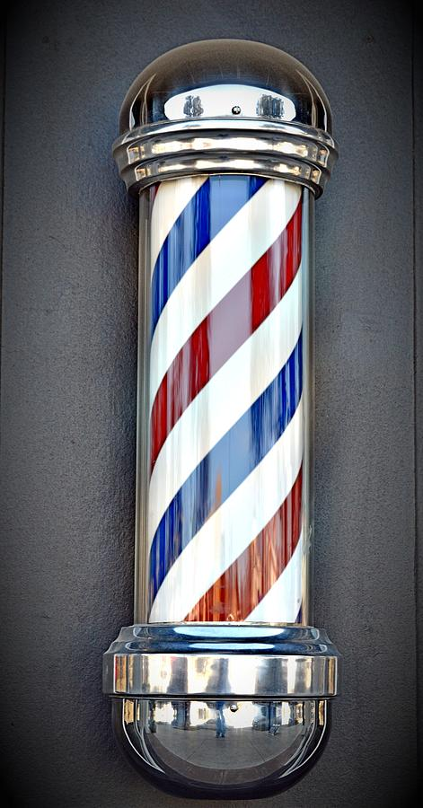

#+TITLE: To Mock a Mockingbird Chapter 3
#+DATE: September 26th, 2025

* To Mock a Mockingbird
#+ATTR_ORG: :align center :width 450
[[../../media/other-cover.jpg]]

Today: chapter 3!
No meeting next week!

* Russell's Paradox

Suppose a barber of a certain town shaves all of and only those inhabitants who do not shave themselves. Does the barber shave himself or not?

#+ATTR_ORG: :align center :width 250

** Answer

No such barber can exist!

* The Liar Paradox

+------------------------------------+
| The Sentence in This Box is False. |
+------------------------------------+

Is the sentence true or false?

* Phillip Jourdain's "Double" Liar Paradox

Consider a card with the following sentence written on one side:

+------------------------------------------+
| The Sentence on the Other Side is False. |
+------------------------------------------+

When the card is turned over, it reads:

+-----------------------------------------+
| The Sentence on the Other Side is True. |
+-----------------------------------------+

* Enter Arturo and Roberto

a) Given any inhabitant X /other than Arturo himself/, Arturo shaves X iff X doesn't shave Arturo. Does this lead to a paradox?

b) Given any inhabitant X, Roberto shaves X iff X /does/ shave Roberto. Does this lead to a paradox?

c) A town contains both Arturo /and/ Roberto, satisfying the above conditions. Does /this/ lead to a paradox? Why or why not?

** Answer

a) Since we specify /other than Arturo himself/, there is no self-reference and no paradox.

b) No contradiction: Roberto shaves himself, and everybody else who shaves him.

* Enter Arturo and Roberto cont'd

- Given any inhabitant X /other than Arturo himself/, Arturo shaves X iff X doesn't shave Arturo.

- Given any inhabitant X, Roberto shaves X iff X /does/ shave Roberto.

c) A town contains both Arturo /and/ Roberto, satisfying the above conditions. Does /this/ lead to a paradox? Why or why not?

** Answer

c) If Arturo shaves Roberto, that means Roberto doesn't shave Arturo, and thus Arturo /doesn't/ shave Roberto. Similarly, if Arturo doesn't shave Roberto, Roberto doesn't shave Arturo, and then Arturo /does/ shave Roberto. Contradiction!

"Incompossible" (card paradox as well)

* What About This One?

Suppose Arturo shaves all and only those inhabitants who shave Roberto, and Roberto shaves all and only those inhabitants who don't shave Arturo. Does this lead to a paradox?

** Answer

No, this is not a paradox. For example, suppose Arturo doesn't shave himself, Arturo shaves Roberto, Roberto doesn't shave Arturo, and Roberto shaves himself. This is a perfectly valid situation. This mere existance of a /single/ non-paradoxical case prevents this from being a paradox.

* Barber for a Day

There is a town with 365 male inhabitants. During one 365-day year, every man was the official barber for a day. To fulfill their duty as official barber, they shaved at least one person. No man served as official barber for more than a day. Nonbarbers could also do shaving.

Let X* be the first person shaved by X on the day when X was the official barber. We are also given that for any day D, there is a day E such that for /any inhabitants/ X and Y, if X shaved Y on day E, then X* shaved Y on day D.

There is no paradox here, but on each day, at least one person shaved himself. Prove it.

* Barber for a Day cont'd

- Each of the 365 male inhabitants is barber for a day, meaning they shave at least one person
- The first person they shave when they're the official barber is X*
- Non-offical-barbers can also shave
- For any day D, there is a day E where if /any/ X shaves Y on day E, then X* shaves Y on day D
- Prove that each day, at least one person shaved himself.

** Answer

Take any day D. We know that there is a day E such that if X shaves Y on day E, then X* shaves Y on day D.

Suppose that on day E, X is the official barber, and Y is X*. Then, we know that X* shaved Y on day D - in other words, X* shaved himself.

* The Barbers' Club

Fact 1: Every member of the club has shaved at least one member.
Fact 2: No member has ever shaved himself.
Fact 3: No member has ever been shaved by more than one member.
Fact 4: There is one member who has never been shaved at all.

This is a quite secret society, and membership levels are a strict secret. One rumour has it that there are only a few dozen members; another has it that there are over a thousand. Which rumour is correct?

** Answer

There are an infinite amount of members!

From fact 4, there is one member who has never been shaved—call him B1. From fact 1, B1 shaves B2. Who does B2 shave? It can't be B1, since he's never been shaved; it can't be B2, since he's already shaved by B1. It must be another member, B3! But who does B3 shave? Analogously, it can't be either B1, B2, or B3. This means B3 must shave B4. And so on, ad infinitum.

* Another Barbers' Club

Another barbers' club obeys the following conditions:

Condition 1: If any member has shaved any member—whether himself or another—then all members have shaved him, though not necessarily all at the same time.
Condition 2: Four of the members are named Guido, Lorenzo, Petruchio, and Cesare.
Condition 3: Guido has shaved Cesare.

Has Petruchio shaved Lorenzo or not?

** Answer

Yes, since the conditions imply that every member has shaved every other member.

* The Exclusive Club

There is another club known as the Exclusive Club. A person is a member of this club iff he doesn't shave anyone who shaves him.

A certain barber named Cardano once boasted that he had shaved every member of the Exclusive Club and no one else. Is he telling the truth or full of hot air?

** Answer

Since the barber has shaved every member of the Exclusive Club and no one else, it follows that no one in the Exclusive Club has shaved him. But if none of his clients [people in the Exclusive Club] have shaved him, then he himself is in the Exclusive Club! And if he is in the Exclusive Club, he has shaved himself, meaning he isn't a member of the Exclusive Club! CONTRADICTION! Cardano is *not to be trusted*.

* Next Meeting

No meeting next week (check out Linux presentation!)

#+ATTR_ORG: :align center :width 450
[[../../media/birb-logo.png]]

*Happy (ornitho)logicking!*
