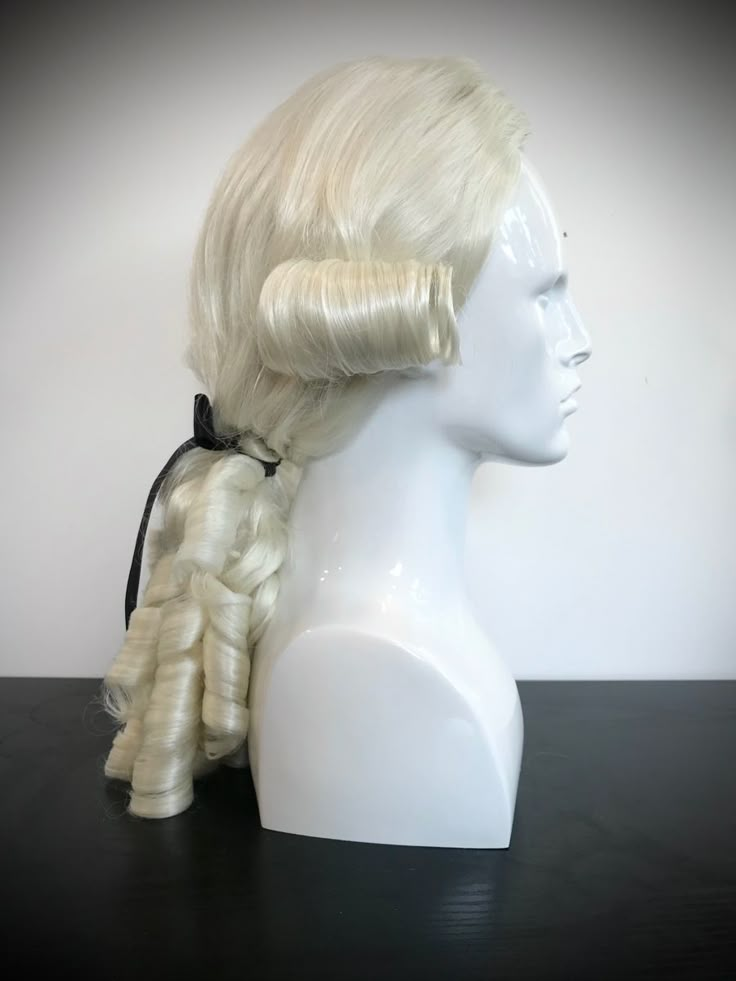

#+TITLE: To Mock a Mockingbird The Barber of Seville
#+DATE: October 3rd, 2025

* To Mock a Mockingbird
#+ATTR_ORG: :align center :width 480
[[../../media/other-cover.jpg]]

Today: what colour is the wig?

* The Barber of Seville

In the mythical town of Seville, the male inhabitants wear wigs on those and only those days when they feel like it. No two inhabitants behave alike on /all/ days.

Given any X and Y, Y is said to be a /follower/ of X if Y wears a wig on all days that X does. Also, given any X, Y, and Z, Z is said to be a /follower/ of X and Y if Z wears a wig on all the days that Z and Y both do.

#+ATTR_ORG: :align center :width 300

* The Barber of Seville cont'd

- No two inhabitants behave alike; follower of X and Y = superset of X∩Y

Five inhabitants of Seville are Alfredo, Bernardo, Benito, Roberto, and Ramano. There is a single barber in Seville.

(1): Bernardo and Benito are opposite in their wig-wearding habits.
(2): Roberto and Ramano are likewise opposites.
(3): Ramano wears a wig on those and only those days when Alfredo and Benito both wear one.
(4): Bernardo is a follower of Alfredo and the barber.
(5): Given any male inhabitant X, if Bernardo is a follower of Alfredo and X, then the barber is a follower of X alone.

Alfredo wears only black wigs; Bernardo wears only white wigs; Benito wears only grey wigs; Roberto wears only red wigs; and Ramano wears only brown wigs.

One Easter morning, the barber was seen wearing a wig. What color was it?

* The Barber of Seville: Brainstorming

(1) Bernardo = ¬Benito  (2) Roberto = ¬Ramano  (3) Ramano = Alfredo ∩ Benito
(4) Bernardo follows Alfredo and the barber
(5) Bernardo follows Alfredo and X ⇨ the barber is a follower of X

We want to find out the colour of the barber's wig. We assume the problem is solvable. The only colours we're aware of (bald is not an option) are the colours of these 5, so let's suppose that the barber is among them.

Suppose Alfredo and Benito are both wearing wigs. Then, Bernardo isn't, Ramano is, and Roberto isn't. Since Bernardo follows Alfredo and the barber, the barber also isn't wearing a wig.

Thus, the barber is either Bernardo or Roberto.

* The Barber of Seville Solution cont'd

(1) Bernardo = ¬Benito  (2) Roberto = ¬Ramano  (3) Ramano = Alfredo ∩ Benito
(4) Bernardo follows Alfredo and the barber
(5) Bernardo follows Alfredo and X ⇨ the barber is a follower of X
· Barber is probably Bernardo or Roberto

To prove that someone is the barber, we can prove that they follow the barber and that the barber follows them (double containment). Since no two people behave the same, this proves that someone is the barber.

Let's try to prove that Roberto is the barber. We need to prove that Roberto follows the barber and that the barber follows Roberto.

* Roberto is a follower of the barber

(1) Bernardo = ¬Benito  (2) Roberto = ¬Ramano  (3) Ramano = Alfredo ∩ Benito
(4) Bernardo follows Alfredo and the barber
(5) Bernardo follows Alfredo and X ⇨ the barber is a follower of X

The barber only impacts other people through (4). So, let's see what happens when we play with it.

Suppose the barber is wearing a wig and Alfredo is wearing a wig. Then, Bernardo is wearing a wig (4) and Benito isn't (1). That means that Ramano isn't wearing a wig (3), and Roberto is (2).

Suppose the barber is wearing a wig and Alfredo isn't wearing a wig. Then, Ramano isn't wearing a wig (3), and Robero is (2).

Every time the barber wears a wig, Roberto does too. Thus, Roberto is a follower of the barber.

* The barber is a follower of Roberto

(1) Bernardo = ¬Benito  (2) Roberto = ¬Ramano  (3) Ramano = Alfredo ∩ Benito
(4) Bernardo follows Alfredo and the barber
(5) Bernardo follows Alfredo and X ⇨ the barber is a follower of X

To prove that the barber follows Roberto, we can show that Bernardo follows Alfredo and Roberto (5).

Suppose Alfredo and Roberto are both wearing wigs. Then, Ramano isn't (2), so Benito isn't (3). Thus, Bernardo is (1).

Since Bernardo wears a wig when Alfredo and Roberto both do, Bernardo follows Alfredo and Roberto. This means that the barber follows Roberto.

Since the barber follows Roberto and Roberto follows the barber, the barber is Roberto. Thus, on this beautiful Easter day, the barber was wearing a red wig.

* Prolog solution

[[./barber.pl]]

* Next Meeting

Next week, we will be reading Chapter 4, "The Mystery of the Photograph".

#+ATTR_ORG: :align center :width 480
[[../../media/birb-logo.png]]

*Happy (ornitho)logicking!*
