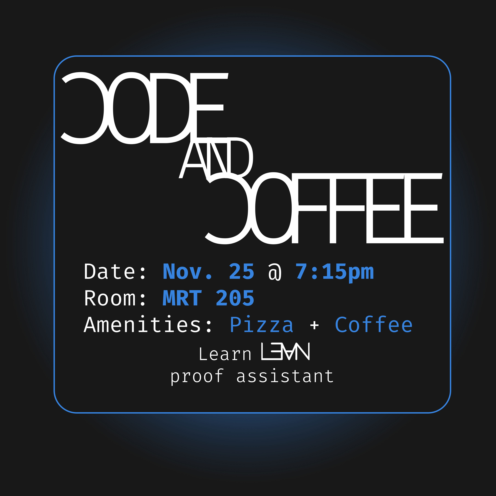

#+TITLE: To Mock a Mockingbird Chapter 6
#+DATE: November 21st, 2025

* To Mock a Mockingbird
#+ATTR_ORG: :align center :width 480
[[../../media/other-cover.jpg]]

Today: chapter 6

* Coming soon...
#+ATTR_ORG: :align center :width 800

* What time is it?

On another occasion I met an inhabitant who said: "During the daylight hours I claim it is night."

Was it then day or night?

** Answer

It's nighttime! The inhabitant is essentially claiming that he's a night-knight. We've already seen that during daytime, everyone claims to be a day-knight; during nighttime, a night-knight.

* What time is it *and* who are you?

On another occasion, a native said to me: "During the day I claim that I am a night-knight. I am really a day-knight."

I was happy that he made this statement because I could then deduce both his type and whether it was night or day. What was the solution?

/Note/: In this and all other problems in this chapter, I am making the underlying assumption that it never changed from day or night or from night to day during the course of the conversation.

** Answer

No inhabitant claims to be a night-knight during the day, therefore he's lying. His next statement is that he's a day-knight, but he's lying, so he's a night-knight, and it's the day.

* What time is it *and* who are you part 2?

On one occasion an inhabitant said: "I am a night-knight and it is now day." Was he a day-knight or a night-knight? Was it then day or night?

** Answer

It's impossible for that statement to be truthfully said, so it's a false statement. This means that one or both of the sub-statements is false. From checking cases, we can see that both are false; so he's a day-night lying during the night. (Also, this is the solution to "who are you part 2" from above!)

* Two questions now!

On another occasion I asked an inhabitant two questions: "Are you a day-knight?" and "Is it now day?" He replied: "Yes is the correct answer to at least one of your questions."

Was he a day-knight or a night-knight? Was it then day or night?

** Answer

Assume that the person is lying and no is the answer to both questions. This means that he's a night-knight during the night, so he should be telling the truth—a contradiction. Therefore, the person is telling the truth.

If yes is the answer to the first question, it's also the answer to the second because he's telling the truth. Likewise, if yes is the answer to the second, it's also the answer to the first. So, both answers are yes, he's a day-knight, and it's the day.

Incidentally, this is the solution to "who are you part 3"!

* Twelve hours

I once asked an inhabitant: "Is it true that twelve hours ago you claimed that you were a night-knight?" He replied: "No." I then asked him: "Twelve hours ago, did you claim that you were a day-knight?" He replied: "Yes".

Was he a day-night or a night-knight?

** Solution

Everyone claims to be a day-night during the day and vice versa. So, asking "is it true that twelve hours ago you claimed that you were a night-knight" is the same as asking "Is it true that twelve hours ago was the night
", which is equivalent to asking "Is it true that it's the day". The inhabitant answers no to this. Day-knights always claim it's the day and vice versa, so he's a night-knight.

* Two Brothers

I once came across two brothers Miguel and Rémi and did not know the type of either, nor did I even know whether they were the same type. I also did not know whether it was day or night at the time. Here is what they said:

  Miguel: At least one of us is a day-knight.
  Rémi: Miguel is a night-knight.

I then knew the type of each and whether it was night or day. What is the solution?

** Solution

Miguel's statement is either true or false. If it's false, that means they're both night-knights, and it's during the day. But then Rémi is saying a true statement as a night-knight during the day, which is a contradiction.

Therefore Miguel's statement is true. If Miguel is a night-knight, then it's during the night, meaning Rémi is also a night-knight, which is a contradiction. So Miguel is a day-night and it's during the day. This means that Rémi is a night-knight.

* Next Meeting

Next meeting will be next Friday at 4 pm in CRX 520.

#+ATTR_ORG: :align center :width 450
[[../../media/birb-logo.png]]

*Happy (ornitho)logicking!*
