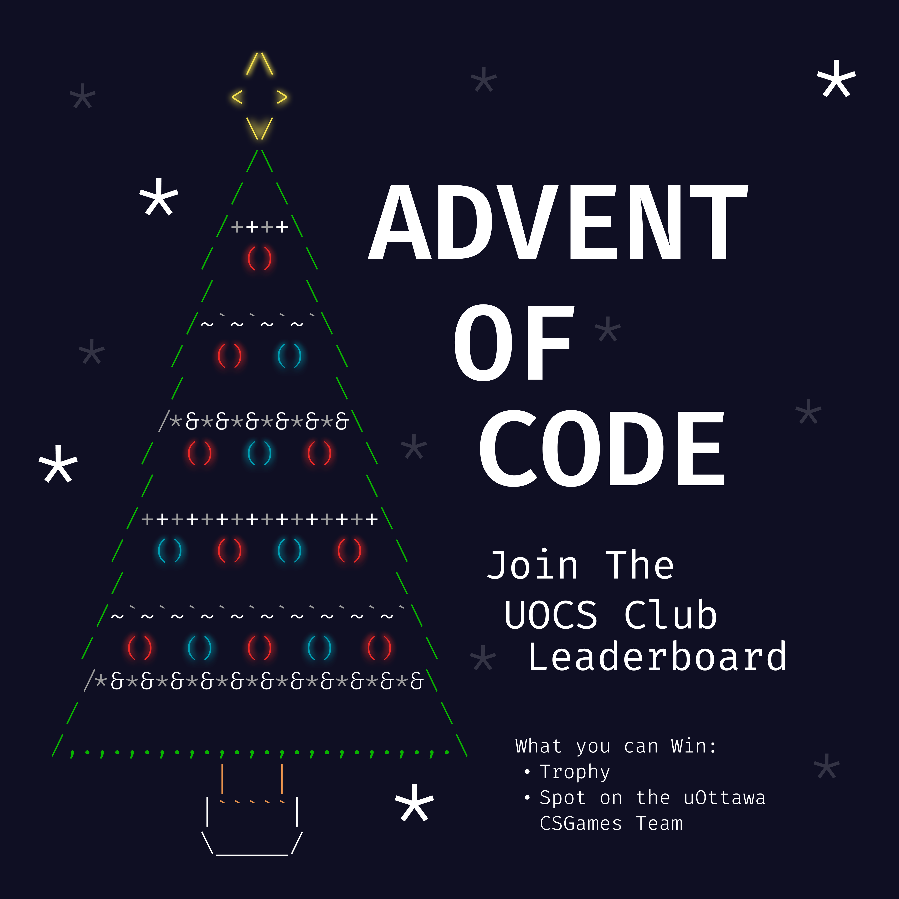
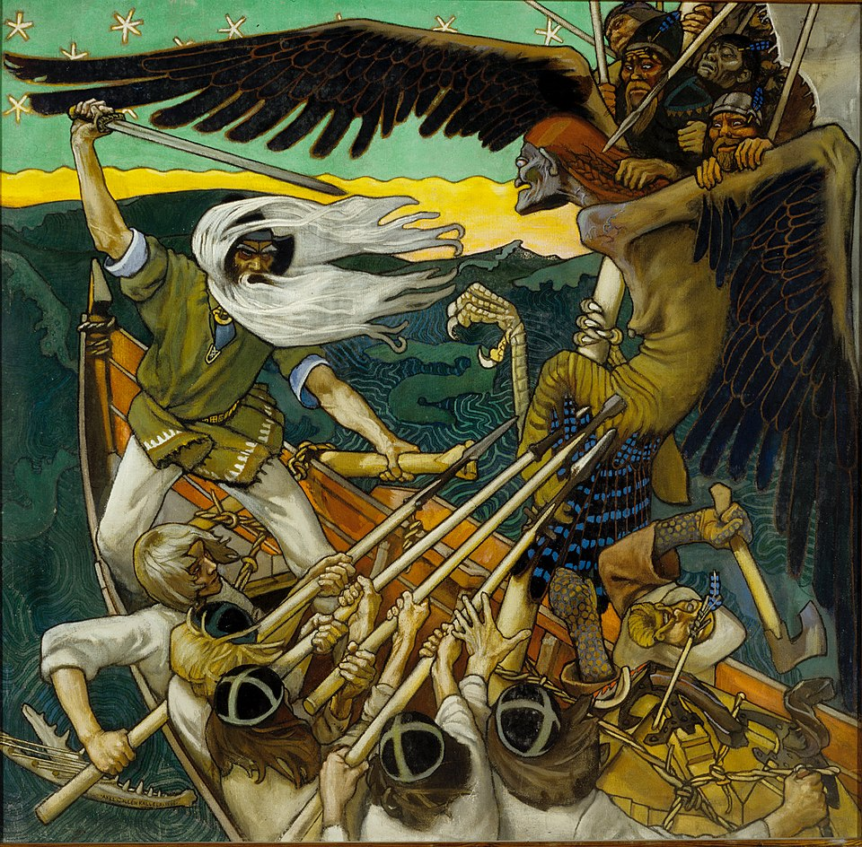

#+TITLE: To Mock a Mockingbird Chapters 6/7
#+DATE: November 28th, 2025

* To Mock a Mockingbird
#+ATTR_ORG: :align center :width 480
[[../../media/other-cover.jpg]]

Today: finish chapter 6 (escape the casino!), start chapter 7

Do we want to continue during exam season?

* Advent of Code
#+ATTR_ORG: :align center :width 700

Special Advent of Code event!

* Two Inhabitants

On another occasion I came across two inhabitants Rémi and Miguel who made the following statements:

Rémi: Both of us are day-knights.
Miguel: That is not true!

Which one should be believed?

** Answer

If they really were both day-knights, they would be in agreement. Since they disagree, they're different types, so Miguel is telling the truth.

* Jim Hawkins

At last I made friends with one of the inhabitants—Jim Hawkins—whom I knew to be a day-knight. At one point he told me that some time earlier he had overheard a conversation between two inhabitants Rémi and Miguel in which Rémi said that Miguel was a day-knight and Miguel said that Rémi was a night-knight.

Was it during the day or during the night that Jim told me this?

** Answer

For this, the time of day doesn't really matter. The statement is equivalent to Rémi saying that Miguel is a knight, and Miguel saying Rémi is a knave. This is impossible. Jim must be lying, so it's during the nighttime.

* A Metapuzzle

Inspector Craig of Scotland Yard also visited the city. Like every other visitor, he lost his sense of time after a few days. At one point he was desirous of knowing whether it was day or night. He came across a married couple but he didn't know whether the husband and wife were of the same type or different types. One of the two said: "My spouse and I are different types; one of us is a day-knight and one of us is a night-knight." Inspector Craig thought about this and said: "What I really want to know is whether it is now day or night. Which is it?" One of the two said: "It is now day." Inspector Craig then knew whether it was day or night.

Was it day or night?

** Solution

Day-knights always claim it's day, and night-knights always claim it's night. Therefore, the one that said "it is now day" (let's call them Rémi) is a day-knight. If this is the same person that made the first statement, we learn nothing, so the first statement was made by the other person (let's say Miguel). If Miguel is a day-knight, then he's lying, so it's the night. If Miguel is a night-knight, then he's lying, so it's night. Therefore, the two statements were made by different people, and it's nighttime.

* Gods, Demons, and Mortals

Inspector Craig dreamed that he spent nine days in a region in which dwelled gods, demons, and mortals. The gods, of course, always told the truth, and the demons always lied. As to the mortals, half were knights and half were knaves. As usual, the knights told the truth and the knaves lied.

#+ATTR_ORG: :align center :width 650

* The First Day

Craig dreamed that on the first day he met a dweller of the region who looked as if he might be a god, though Craig could not be sure. The dweller evidently guessed Craig's thoughts, smiled benevolently, and made a statement to reassure him. From this statement, Craig /knew/ that he was in the presence of a god.

Can you supply such a statement?

** Answer

"I am not a knight" <=> "I am either a god, a demon, or a knave."
* The Second Day

In this episode of the dream, Craig met a terrifying-looking being who had every appearance of being a demon.

"What sort of being are you?" asked Craig, in some alarm.

The being answered, and Craig then realized that he was confronting not a demon, but a knave. What could the being have answered?

** Answer

"Fear me, for I am a demon!"

* The Third Day

In this episode, Craig met a totally nondescript-looking being who from appearances could have been anything at all. The being then made a statement from which Craig could deduce that he was either a god or a demon, but Craig could not tell which.

Can you supply such a statement?

** Answer

"I am a god or a knave."

* The Fourth Day

Craig next met a being who made the following two statements:

1. A god once claimed that I am a demon.
2. No knight has ever claimed that I am a knave.

What sort of being was he?

** Answer

The first statement is clearly false. That means the second is false as well, so the speaker is a knave.

* Next Meeting

Next meeting will be next Friday at 4 pm in CRX 520.

#+ATTR_ORG: :align center :width 450
[[../../media/birb-logo.png]]

*Happy (ornitho)logicking!*
