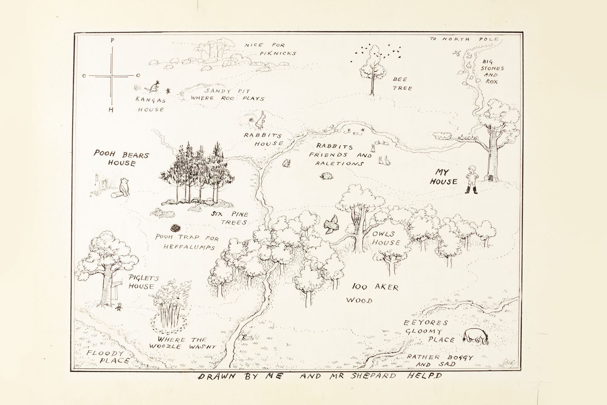
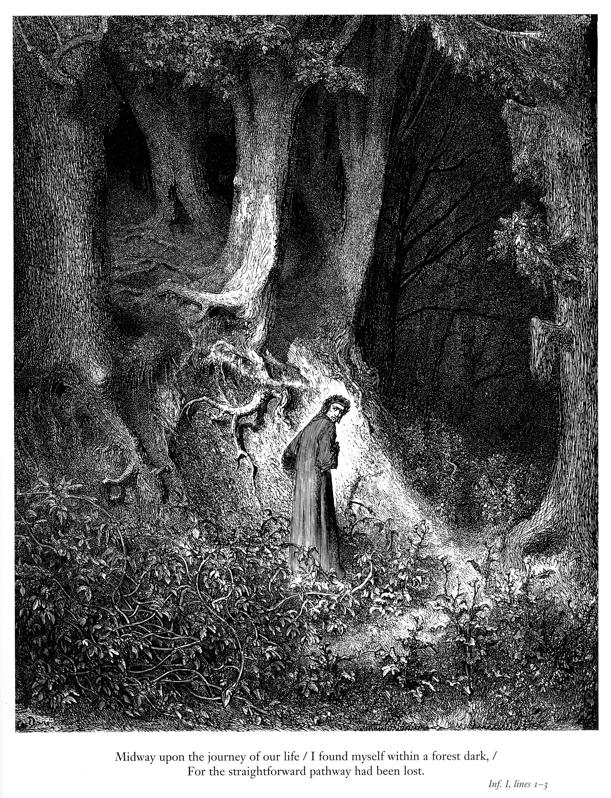
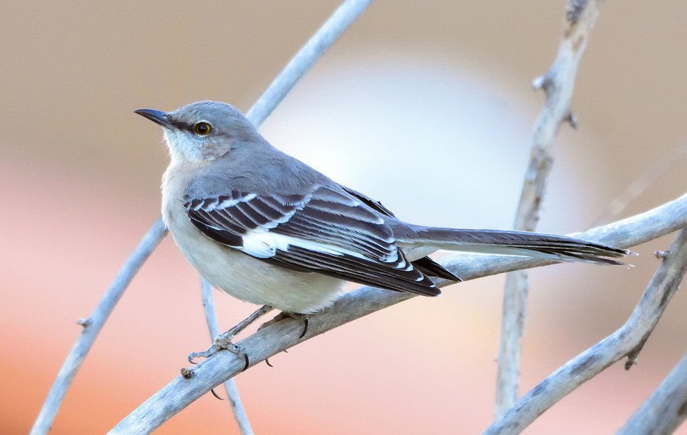

#+TITLE: To Mock a Mockingbird Chapter 9
#+DATE: January 30th, 2026

* To Mock a Mockingbird
#+ATTR_ORG: :align center :width 480
[[../../media/other-cover.jpg]]

Today: we finally get to mock some mockingbirds!

* A Grand Metapuzzle
A: If B is a knave, then the Fountain of Youth is on this island.
B: I never claimed that the Fountain of Youth is not on this island!

Reynolds then asks directly if the Fountain is on the island or not. One of the two answers either yes or no, and Reynolds then knows whether the Fountain of Youth is on the island.

Craig, not knowing who answered and what the answer was, asks "Suppose the other had answered instead. Do you know if you could have decided whether or not the Fountain is on the island?"
Reynolds responds (yes or no), and Craig knows whether the Fountain of Youth is on the island.

Is the Fountain of Youth on the island?

** Answer

A is a knight, we know nothing about B. So if A says yes or no, Reynolds knows for sure. If B says yes, he must be a knight (if he was a knave, contradiction with A's statement). If B says no, either he's a knight and the FoY isn't on the island, or he's a knave and it is. Since Reynolds knows the answer, either A answered yes, A answered no, or B answered yes.

Suppose A answered yes. If B is a knight he would answer yes and if he is a knave he would answer no, so Reynolds would tell Craig "no", since he has /no idea/ if he could figure it out.
Suppose A answered no. If B had answered instead, he must be a knave and answer no. But Reynolds wouldn't know whether he's a knight or a knave. He would answer "yes" to Craig, since he's sure he /couldn't/ figure it out.
Suppose B answered "yes". Then, if A had answered instead, Reynolds would know for sure, so he would answer "yes" to Craig, since he's sure he /could/ figure it out.
* A Certain Enchanted Forest

If you call out the name of B to A, A will respond by calling out the name of some bird to you, the bird we designate by AB. In general, AB is not necessarily the same bird as BA. Also, the bird A(BC) is not necessarily the same as the bird (AB)C.

/Mockingbirds/: a bird M such that for any bird x, the following condition holds: Mx = xx

M /mimics/ x as for as its response to x goes. That means that if you call out x to M or if you call out x to itself, you will get the same response in either case.

#+ATTR_ORG: :align center :width 750

* A Certain Enchanted Forest Cont'd

/Composition/: given any birds A, B, and C (not necessarily distinct), the bird C is said to /compose/ A with B if for every bird x the following condition holds: Cx = A(Bx)

In other words, this means that C's response to x is the same as A's response to B's response to x.

#+ATTR_ORG: :align center :width 500

* The Significance of the Mockingbird

Composition condition: For any two birds A and B (whether the same for different), there is a bird C such that for any bird x, Cx = A(Bx).

Mockingbird condition: The forest contains a mockingbird M (Mx = xx).

One rumour has it that every bird of the forest is fond of at least one bird (for every A, there exists a B where AB = B). Another rumour has it that there is at least one bird that is not fond of any bird. It is possible to settle the matter completely by virtue of the given two conditions. Which rumour is true?

#+ATTR_ORG: :align center :width 400

** Answer

Consider an arbitrary bird A. By the composition condition, there exists a bird B that composes A and M. In other words, Bx = A(Mx) = A(xx) for all birds x.

Now, what will happen if we call out B to B? BB = A(BB). So A is fond of BB!

* Next Meeting

Next meeting will be next Friday at 4 pm in CRX 520.

#+ATTR_ORG: :align center :width 450
[[../../media/birb-logo.png]]

*Happy (ornitho)logicking!*
