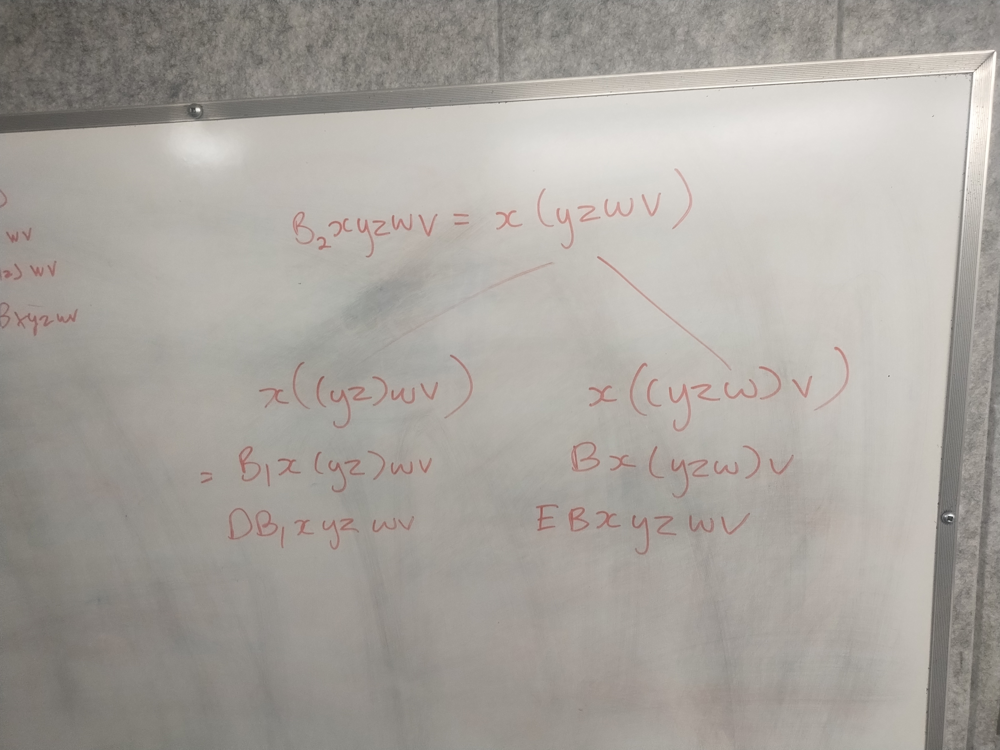

#+TITLE: To Mock a Mockingbird Chapter 11
#+DATE: March 27th, 2026

* To Mock a Mockingbird
#+ATTR_ORG: :align center :width 500 :align center
[[../../media/dore.jpg]]

Today: RUSH 🅱️! Easter meeting? Goodbye Emilien :(

* Egocentric

Given a bluebird B [Bxyz = x(yz)] and a mockingbird M [Mx = xx], can you see how to write down an expression for an egocentric bird?

** Answer

Book's answer: M is fond of some x, namely, M(BMM). We've seen before that if M is fond of x, x is egocentric. So M(BMM) is egocentric.

My answer:

Consider the bird BM. BM is fond of an x, so (BM)x = x. (BM)xy = xy, M(xy) = xy, (xy)(xy) = xy, xy is egocentric.

We can actually write x (from the last problem) as M(B(BM)M). So for all y, M(B(BM)M)y is egocentric.

* Hopelessly egocentric

Now, suppose a forest contains a bluebird B, a mockingbird M, and a kestrel K. See if you can write down an expression in terms of B, M, and K for a hopelessly egocentric bird.

** Answer

There is a bird that K is fond of. We've seen before that if Kx = x, x is hopelessly egocentric. So x = M(BKM) is hopelessly egocentric.

* Doves

Bxyz = x(yz) = (x∘y)(z)
Bxy = x∘y
Dxyzw = xy(zw)

The bird D can be derived from B alone. Can you see how?

** Answer

D = BB

Dxyz = BBxyzw = B(xy)zw = xy(zw)

Dxyzw = xy(zw)
= ((xy)∘z)w
= B(xy)zw
= (B∘x)yzw
= BBxyzw

* Blackbirds

B₁xyzw = x(yzw)

Prove that any forest containing a bluebird must also contain a blackbird. Of course, you are free to use the dove D if that is helpful, since you have already seen how D can be derived from B.

** Answer

B₁xyzw = x(yzw) = x∘(yz) = Bx(yz) = (Bx)∘y = DB = BBB

* Eagles

Exyzwv = xy(zwv)

** Answer

xy(zwv) = B₁(xy)zwv = BB₁ = B(BBB)

* Buntings 

B₂xyzwv = x(yzwv)

** Answer
B₂ = DB₁ = BB(BBB)
or = EB  = B(BBB)B

#+ATTR_ORG: :align center :width 800 :align center

* Dickcissels

D₁xyzwv = xyz(wv) 

** Answer

D₁ = D(xy)zwv = D(xy) = BDxy = BD = B(BB)

* Becards

B₃xyzw = x(y(zw))

** Answer

B₃xyzw = x(y(zw)) = B(Bxy) = BB(Bx) = B(BB)B

* Next Meeting

This Thursday (because of Good Friday), CRX-526, 4 PM

#+ATTR_ORG: :align center :width 450
[[../../media/birb-logo.png]]

*Happy (ornitho)logicking!*
